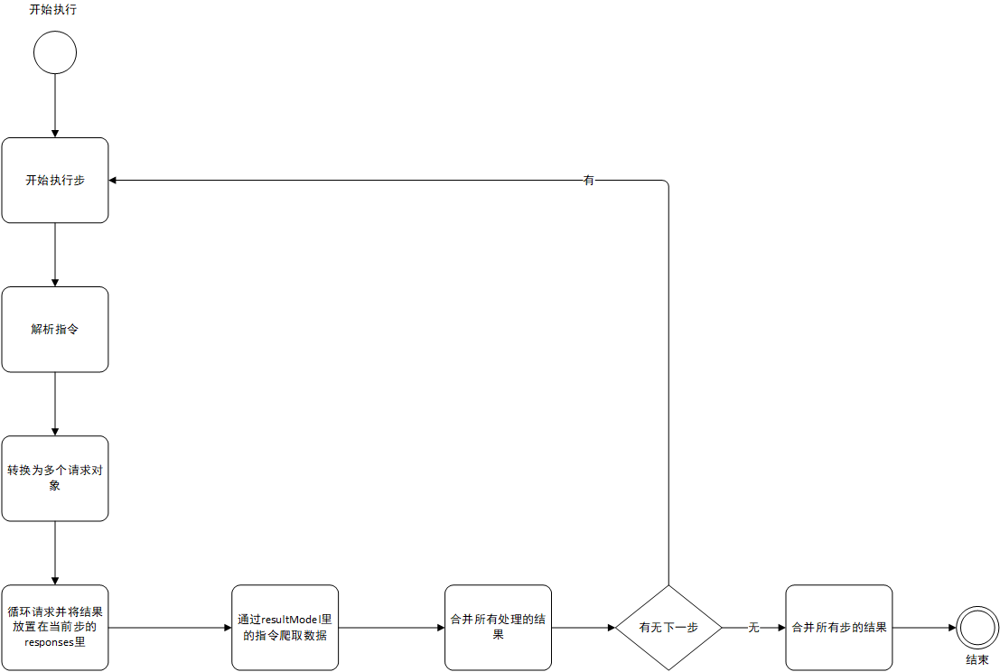

<!--
 Copyright 2020 WumaCoder
 
 Licensed under the Apache License, Version 2.0 (the "License");
 you may not use this file except in compliance with the License.
 You may obtain a copy of the License at
 
     http://www.apache.org/licenses/LICENSE-2.0
 
 Unless required by applicable law or agreed to in writing, software
 distributed under the License is distributed on an "AS IS" BASIS,
 WITHOUT WARRANTIES OR CONDITIONS OF ANY KIND, either express or implied.
 See the License for the specific language governing permissions and
 limitations under the License.
-->

# http-crawler

一个强大的配置式爬虫引擎。

## 特点

- 配置方式爬虫
- 支持浏览器环境
- 支持自定义指令
- 支持TS

## 安装

```cmd
npm i http-crawler
```

## 使用

现在我们爬取http://okzyw.com网站的电影，想要实现的功能是通过一个电影的名称来爬取所有和名称匹配的视频

```js
const { HttpCrawler } = require('../dist/http-crawler.cjs');

const okzyw = new HttpCrawler(
  {
    meta: {
      //元数据对象
      name: 'okzyw',
      version: 1,
      search: ''
    },
    option: {
      delay: 300, //ms 请求延迟
      errRetry: 5, // 重试次数
    },
    steps: [
      {
        url: 'http://okzyw.com/index.php?m=vod-search',
        method: 'post', //请求方式
        dataType:'formdata', //data的数据类型，可选json与formdata
        data: {
          wd: '{{v-meta=$.search}}', //{{v-meta=$.search}} 调用v-meta指令并且返回$.search查询mete对象里的值
          submit: 'search'
        },
        resultModel: { // 返回的数据模型
          title: '{{v-response-html=.xing_vb4|$[*].structuredText}}',
          router: '{{v-response-html=.xing_vb4|$[*].firstChild.attributes.href}}',
        },
      },
      {
        url: 'http://okzyw.com{{v-prev-mres=$[*].router}}',
        method: 'get',
        isMergeResult:false, //不用将结果合并
        resultModel: {
          title: '{{v-response-html=[name=copy_sel]|$[*].parentNode.structuredText}}',
          voideUrl: '{{v-response-html=[name=copy_sel]|$[*].attributes.value}}',
        },
      }
    ]
 });

async function main() {
  const res = await okzyw.run({search:'超电磁炮'});
  //执行所有的step
  console.log(res); // Array(3) [Object, Object, Object]
}

main();
```

## 核心思想



### 步Step

所有的操作都是以步的方式进行，通过`httpCrawler.go()`的方式执行,如果执行所有的步使用`httpCrawler.run()`来操作。

### 指令directive

指令是相当与是一个函数，通过`{{v-meta=JSONSelector}}`的方式调用，这里使用的是v-meta这个指令，参数JSONSelector是一个JSON查询的表达式，通过JSONSelector来获取meta对象里的值，在http-crawler里还有很多的指令来进行不同的操作，你也可以自定义指令来扩充指令集，注意指令只能在

`$.steps[*].url`

`$.steps[*].params`

`$.steps[*].data`

`$.steps[*].header`

`$.steps[*].resultModel`

里使用

## 配置

```js
export interface HttpCrawlerConfig{
  directive?: any;
  meta?:any;
  option?:any;
  steps:any[];
}

const config = {
    directive:{
        ['v-timestamp'](retfer, arg){
            // retfer是参照对象，一般是this
            // arg是第一个等于号后面的字符串
            return Date.now();
        }
    },
    meta:{ // 存储一些用户临时的数据
        name:'名称',
        version:0,
        search:'超电磁炮'
    },
    option:{
    	delay: 300, //ms 请求延迟
        errRetry: 5, // 错误重试次数
        timeout: 30*1000, //ms 请求超时
	},
    steps:[
        {
            url: 'http://okzyw.com/index.php',
            method: 'post', //请求方式
            dataType:'formdata', //data的数据类型，可选json与formdata
            params:{ // get传值
                m:'vod-search'
            },
            data: { // post传值
              wd: '{{v-meta=$.search}}', //{{v-meta=$.search}} 调用v-meta指令并且返回$.search查询mete对象里的值
              submit: 'search'
            },
            resultModel: { // 返回的数据模型
              title: '{{v-response-html=.xing_vb4|$[*].structuredText}}',
              router: '{{v-response-html=.xing_vb4|$[*].firstChild.attributes.href}}',
            },
        }
    ]
};
```

## 指令

### v-meta

查询元对象数据

参数：JSONSelector

返回值：JSONSelector查询到的值

例子：

"{{v-meta=$.version}}"

### v-prev

查询上步的step对象

参数：JSONSelector

返回值：查询结果

### v-prev-mres

查询上一步的mergeResults对象，这个与resultModel的结构一致

参数：JSONSelector

返回值：查询结果

### v-prev-res

查询上一步的results对象

参数：JSONSelector

返回值：查询结果

### v-refer

查询整个实例对象

参数：JSONSelector

返回值：查询结果

### v-state

查询实例状态对象

参数：JSONSelector

返回值：查询结果

### v-current

查询当前步对象

参数：JSONSlector

返回值：查询结果

### v-response

查询当前的响应结果，注意响应结果必须为json

参数：JSONSelector

返回值：查询结果

### v-response-html

查询当前响应，注意响应结果必须为html字符串

参数：CSSSelector|JSONSelector

返回值：查询结果

例子：

"{{v-response-html=.xing_vb4|$[*].structuredText}}"

## 方法

### .on(event:string, callback:Function)

监听事件

### .go(meta?:object)

返回值：Promise<Result[]|MergeResult[]>

执行一步

### .run(meta?:object)

返回值：Promise<Result[]|MergeResult[]>

执行所有步

### .mergeResult()

返回值：object[]

合并所有的结果，这一步已经在run中执行

### .reset()

重置当前实例对象，删除所有结果，恢复状态

## 事件

我们可以使用事件回调函数on来记录日志。

例子：

```js
okzyw.on('start',()=>{
  console.log('开始');
})

okzyw.on('end',()=>{
  console.log('结束');
})

okzyw.on('err',(error)=>{
  console.log(error);
})

okzyw.on('go:before',({ state })=>{
  console.log('开始第'+(state.current)+'步');
})

okzyw.on('go:after',({state})=>{
  console.log('完成第'+(state.current)+'步');
})

```

上面是所有的事件。

## 其他

### JSONSelector

引擎中的很多指令都是使用开源的 [jsonpath](https://www.npmjs.com/package/jsonpath) ，来实现JSON查询，具体语法请查阅文档

### CSSSelector

引擎中v-response-html中dom查询使用的是 [node-html-parser](https://www.npmjs.com/package/node-html-parser) 开源包，可以直接使用css选择器，但是在查询结果上会有一些差异，具体查看相关文档。

